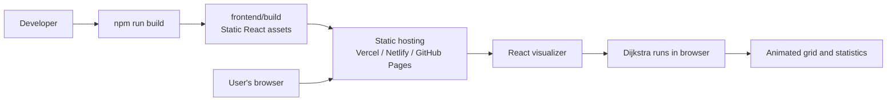

# Dijkstra Visualizer

An interactive React application for learning how Dijkstra's shortest-path algorithm explores a grid. The complete experience runs in the browser: there is no backend, database, or code-execution service.

## Features

- Draw walls by clicking or dragging across the grid.
- Move the start and finish nodes anywhere on the board.
- Watch nodes being explored and the final shortest path animate in sequence.
- Generate random walls or clear the board.
- Choose slow, normal, or fast animation speed.
- View explored-node count, path length, distance, and run status.

## How it works

Each grid cell is treated as a graph node with up to four neighbors. All edges have a weight of one, so Dijkstra's algorithm expands the closest unvisited node, updates its neighbors, and records the previous node used to reconstruct the final path.

The algorithm runs entirely in the browser through `frontend/src/algorithms/dijkstra.js`. The React visualizer animates the visited nodes first and then highlights the reconstructed shortest path.

## Deployment architecture

The app is deployed as a static React build. After `npm run build`, the files in `frontend/build` can be served by any static hosting provider such as Vercel, Netlify, or GitHub Pages.



No API calls are required at runtime. The deployment serves HTML, CSS, JavaScript, and image assets directly to the browser.

## Run locally

```bash
cd frontend
npm install
npm start
```

Open [http://localhost:3000](http://localhost:3000) in your browser.

## Project structure

- `frontend/src/PathfindingVisualizer/PathfindingVisualizer.jsx` - visualizer UI and interactions.
- `frontend/src/algorithms/dijkstra.js` - Dijkstra implementation and shortest-path reconstruction.
- `frontend/src/PathfindingVisualizer/Node/Node.jsx` - individual grid node component.
- `frontend/src/App.js` - application shell and visualizer entry point.
- `frontend/src/PathfindingVisualizer/PathfindingVisualizer.css` - visualizer layout and controls.

## Available scripts

Run these commands from `frontend`:

```bash
npm start       # Start the development server
npm run build   # Create a production build in frontend/build
npm test        # Run the test runner (tests are not currently included)
```
